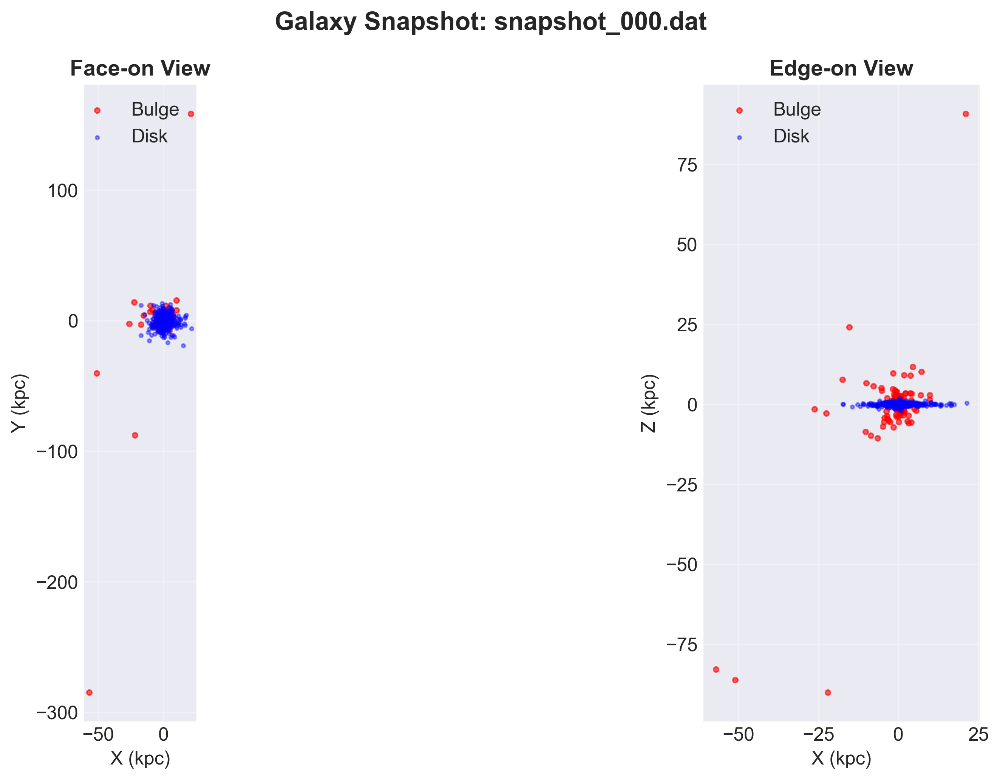
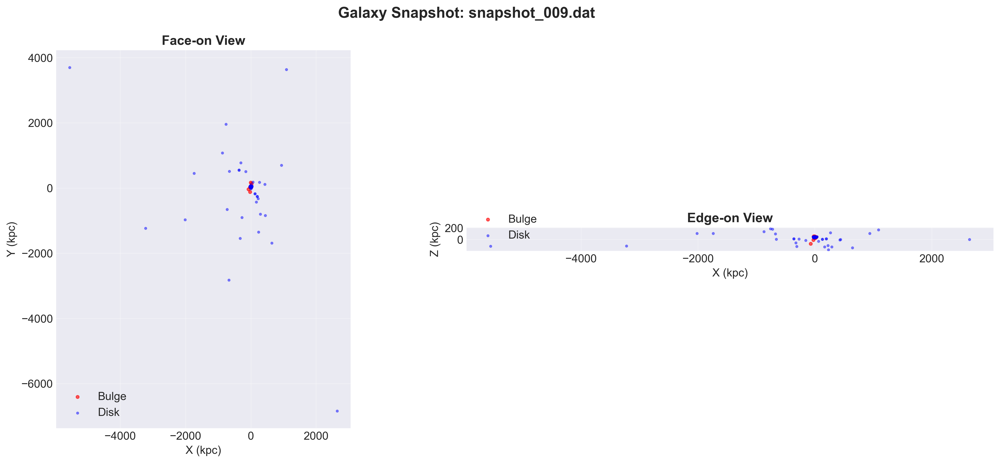
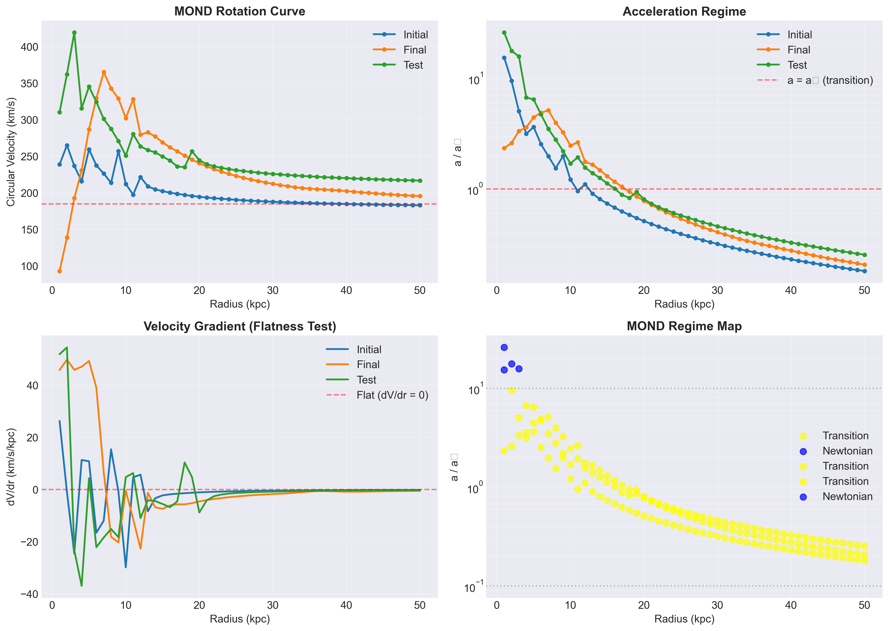

# 🌌 MOND 3D Physics Engine
A C-based physics simulator implementing **Modified Newtonian Dynamics** to simulate galaxy evolution without Dark Matter.

## 📊 Live Simulation Results
These plots were generated by the engine running on my MacBook Air.

### 1. Galaxy Evolution (2.0 Gyr)
The simulation tracks 1,000 particles over 2 billion years. 
| Initial State (T=0) | Final State (T=2.0 Gyr) |
| :---: | :---: |
|  |  |

### 2. Physics Validation

*This plot confirms the "Flat Rotation Curve" prediction—stars at the edge move at nearly constant velocity.*

## 🛠 Project Structure
* **`mond_physics_engine.c`**: The core math engine (QUMOND formulation).
* **`mond_sim`**: Optimized executable compiled for Apple Silicon.
* **`visualize_mond.py`**: Data analysis and plotting suite.

## 🚀 How to Run
\`\`\`bash
make
./mond_sim   # Enter 'y' for full simulation
python3 visualize_mond.py
\`\`\`
